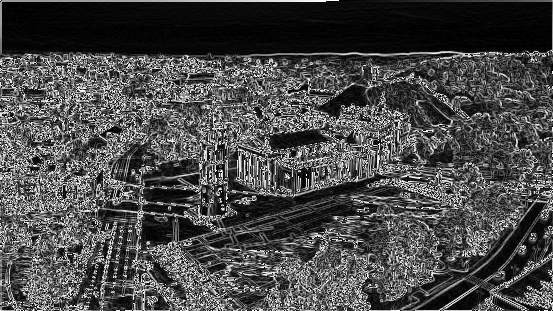

# Image editor

## Overview

This project is a simple Work In Progress image editor that allows you to apply some basic filters to an image.

The application is made of two parts:

1. The background process (running on a web worker) that applies the filters to the image. This is where the actual image processing happens.
2. The main front-end application that users interact with.

## Supported filters

The application already supports the following filters:

| Add top text to the image        | Blur                     | Edge detection                               |
| -------------------------------- | ------------------------ | -------------------------------------------- |
|  |  |  |

The effects are **stackable**, meaning that the user can apply multiple filters to the image on top of each other. For example, the following image was created with the following steps:

1. Add top text "TOP TEXT".
2. Apply blur filter.
3. Apply top text "ABC".


## Your task

Image processing is definitely not a task you encounter on a daily basis, so do not worry! The filters are already implemented and working.

You are given the starting point of the application, however, the user interface is missing. You need to create a user interface that allows the user to apply the filters one by one.

**Your task is to create a user interface to allow the following:**

1️⃣. Load and use an image from a remote URL.<input type="checkbox"><br>
2️⃣. Add top text to the image with user defined text.<input type="checkbox"><br>
3️⃣. Apply the blur filter to the image with user defined radius.<input type="checkbox"><br>
4️⃣. Apply the edge detection filter to the image.<input type="checkbox"><br>
5️⃣. Support undo/redo functionality.<input type="checkbox"><br>

❗ **IMPORTANT** ❗

1. The effects **MUST** be called from the background process (like they are in the original code). Calling the effects from the main process would freeze the entire website.
2. The filters should be applied one by one. The user should see the image changing as they apply the filters. For example, the user should be able to add top text, see the result, then blur image, see the result, and so on.

As an example, here is a wireframe of the user interface. You can use it as a reference, but feel free to change it as you see fit.


Do not worry about the visual design of the application. We are more interested in the functionality and the implementation quality - clean code, good architecture, good separation of concerns.

**You are free to change anything in the project structure (or communication layer) as you see fit! Do not be afraid of touching the existing code :)**

## Getting started

The project is already set up and ready.

1. To install the dependencies, run

```bash
npm install
```

2. To start the application, run

```bash
npm run dev
```

## Using Your Preferred Library or Framework

The app is built using the Vite TypeScript template, but you’re free to choose any UI framework or library you prefer. If you’d like to use React, we’ve provided a setup guide below. However, feel free to integrate any other framework or library that fits your workflow.

### How to start using React

To set up the project with React, follow these steps:

1. Install React, ReactDOM, and the Vite React plugin:

   ```bash
   npm install react react-dom
   npm install --save-dev @vitejs/plugin-react
   ```

2. Install the React type definitions:

   ```bash
   npm install --save-dev @types/react @types/react-dom
   ```

3. Open `vite.config.ts`, and uncomment the lines that import and enable the React plugin.

4. In `index.html`, replace the `<body>` section with the following:

   ```
   <body>
     <div id="root"></div>
     <script type="module" src="/src/main/main.tsx"></script>
   </body>
   ```

5. Rename `src/main/main.ts` to `src/main/main.tsx`. Then, comment out the original code and replace it with the following:

   > **Note**: The following code mirrors the content of the original index.html. However, the buttons are non-functional at this stage. This serves as a starting point — you’ll need to implement the required functionality.

   ```tsx
   import { StrictMode } from "react";
   import { createRoot } from "react-dom/client";

   createRoot(document.getElementById("root")!).render(
     <StrictMode>
       <div>
         <button id="generate" type="submit">
           Generate image
         </button>
         <div>
           <canvas id="generated-image"></canvas>
         </div>
       </div>
     </StrictMode>,
   );
   ```

## Communication between main process and background process

The main process sends a message to the background process, the background process processes the image and sends the result back to the main process.

The communication between the main process and the background process is already set up and working like this:

```ts
const { addMessageListener, sendMessage } = createBackgroundProcess();

addMessageListener((responseFromBackground: any) => {
  console.log(
    "Main process received response from background process:",
    responseFromBackground,
  );
});

sendMessage({ anyValue: "that you want to send to background process" });
```

Background process:

```ts
const { addMessageListener, sendMessage } = createChannelToMainProcess();

addMessageListener((responseFromMain: any) => {
  console.log(
    "Background process received response from main process:",
    responseFromMain,
  );
});

sendMessage({ anyValue: "that you want to send to main process" });
```

## Submitting your solution

You can submit your solution during the follow up call (after 2 hours of coding). No need to submit the solution before the call.

You can submit your solution in one of the following ways:

- Invite us to a **private** Github repository.
- Send us a link to zip file in any cloud storage (not as email attachment - our email might block zip files).

**Good luck!**
